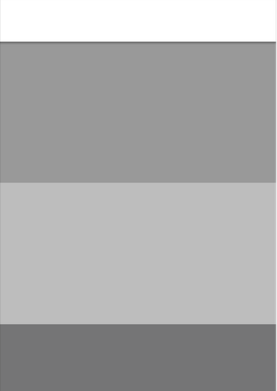

# Exercice 6

## Modalités

- Versionnez le code avec `Git` et `GitHub`
- Reutilisez le code HTML et CSS réalisés dans l'exercice 5 avec les maquettes 2 et 3

## Enoncé

1. Réalisez les mises en page mobiles des maquettes suivantes à partir du code HTML et CSS de l'exercice 5.

## Maquette 2

## Maquette 3

